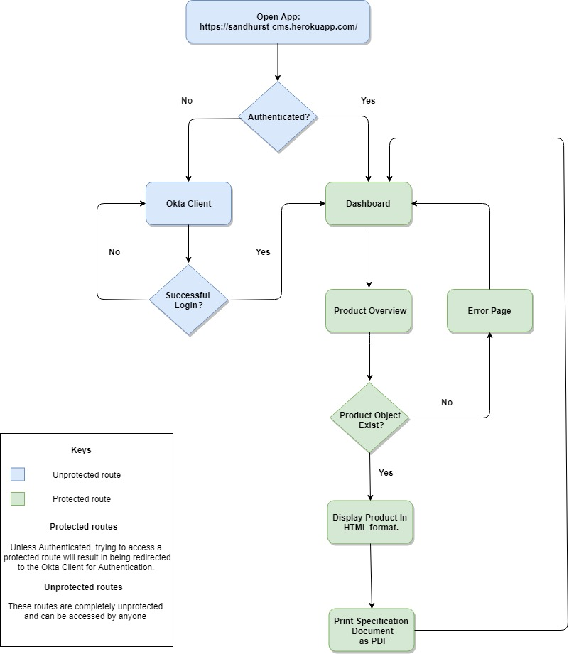
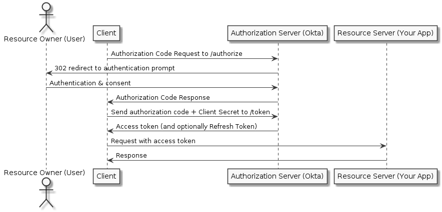

This project was bootstrapped with [Create React App](https://github.com/facebook/create-react-app).

## Available Scripts

In the project directory, you can run:

### `npm start`

Runs the app in the development mode. 
Open [http://localhost:3000](http://localhost:3000) to view it in the browser.

The page will reload if you make edits. 
You will also see any lint errors in the console.

### `npm test`

Launches the test runner in the interactive watch mode. 
See the section about [running tests](https://facebook.github.io/create-react-app/docs/running-tests) for more information.

### `npm run build`

Builds the app for production to the `build` folder. 
It correctly bundles React in production mode and optimizes the build for the best performance.

The build is minified and the filenames include the hashes. 

See the section about [deployment](https://facebook.github.io/create-react-app/docs/deployment) for more information.

### `npm run eject`

**Note: this is a one-way operation. Once you `eject`, you can’t go back!**

If you aren’t satisfied with the build tool and configuration choices, you can `eject` at any time. This command will remove the single build dependency from your project.

Instead, it will copy all the configuration files and the transitive dependencies (Webpack, Babel, ESLint, etc) right into your project so you have full control over them. All of the commands except `eject` will still work, but they will point to the copied scripts so you can tweak them. At this point you’re on your own.

You don’t have to ever use `eject`. The curated feature set is suitable for small and middle deployments, and you shouldn’t feel obligated to use this feature. However we understand that this tool wouldn’t be useful if you couldn’t customize it when you are ready for it.

## Learn More

You can learn more in the [Create React App documentation](https://facebook.github.io/create-react-app/docs/getting-started).

To learn React, check out the [React documentation](https://reactjs.org/).

## Styling
This application utilizes: 

CSS: https://developer.mozilla.org/en-US/docs/Web/CSS

Reactstrap: https://reactstrap.github.io/

## User Flow Chart

## Okta Auth

Documentation: https://developer.okta.com/docs/api/resources/authn

The Okta Authentication API provides operations to authenticate users, perform multi-factor enrollment and verification, recover forgotten passwords, and unlock accounts. It is used as a standalone API to provide the identity layer on top of your existing application.

* Primary authentication allows you to verify username and password credentials for a user.
* Multifactor authentication (MFA) strengthens the security of password-based authentication by requiring additional verification of another factor such as a temporary one-time password or an SMS passcode. The Authentication API supports user enrollment with MFA factors enabled by the administrator, as well as MFA challenges based on your Okta Sign-On Policy.
* Recovery allows users to securely reset their password if they’ve forgotten it, or unlock their account if it has been locked out due to excessive failed login attempts. This functionality is subject to the security policy set by the administrator.

### **How its Used**

## React App

Documentation: https://reactjs.org/

React is a JavaScript library for building user interfaces.

React makes it painless to create interactive UIs. Design simple views for each state in your application, and React will efficiently update and render just the right components when your data changes. Declarative views make your code more predictable, simpler to understand, and easier to debug.

## Google Sheets API

Documentation: https://developers.google.com/sheets/api/

Google Sheets API allows developers programmatically:

* Read and write data
* Format text and numbers
* Build pivot tables
* Enforce cell validation
* Set frozen rows
* Adjust column sizes
* Apply formulas

And more.

### **How its Used**

This API is used to interface with the google sheet of Sandhurst products and suppliers.

A get request is made to the GoogleDrive pulling the entire sheet contents (CMS data) which returns a JSON object of products( Array ) which are iterated through, creating an element for every item in the array. Each product is identified by it's product code which allows for the correct data to be transfered to the product overview page through history. 

## Future Improvements

### Server
This application is running on a webpack service and will require to be moved to a dedicated server (NodeJS).

### Testing
The Application underwent Alpha testing by Sandhurst Senior Staff and myself to check for anomalies. Beta testing is still required by staff.

### PDF exporting function
The application needs a natural HTML view that is readable for each product as well as functionality to export PDF's.

### Inbuilt Authentication
Application requires inbuilt authentication to remove the reliance on the Okta API.

### Expand to also export PIF statements
Currently this application exports specification documents and could easily be expanded to export PIF documents.